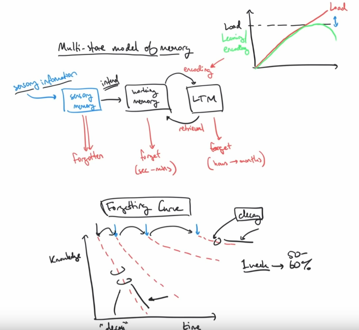

####################################################################################
Active-Recall and Spaced-Repetition
####################################################################################

(Summary from `this video <https://www.youtube.com/watch?v=--Hu2w0s72Y>`_ by Justin Sung).

**DISCLAIMER: I do not own any of the images used in here. They are taken from the video that Justin doodled.**

============================================================================
Takeaways
============================================================================

* Studying is not the same as learning
* Studying is physical while learning is a cognitive process

    .. image:: ../img/004activerecall01.png
      :width: 600
      :alt: Active-Recall 01

* Studying techniques that produce low learning are time consuming
* Different techniques invoke different levels of learning
* Memory going into long-term memory is called encoding
* Level of encoding determines a significant amount of retention
* Retrieving memory from long-term to working memory in order to use it for applications is called retrieval
* Information that is in working memory instead of long term is forgotten very quickly

    .. image:: ../img/004activerecall02.png
      :width: 800
      :alt: Active-Recall 02

* Active recall and spaced repetition work through adjusting the forgetting curve only through repetition

    .. image:: ../img/004activerecall03.png
      :width: 600
      :alt: Active-Recall 03

    .. image:: ../img/004activerecall04.png
      :width: 600
      :alt: Active-Recall 04

* This is only working on retrieval aspect of memory only
* This doesn't help with encoding
* Encoding would reduce the knowledge decay of the forgetting curve to reduce the number of repetitive revisions and relearning sessions needed, therefore saving lots of time

    .. image:: ../img/004activerecall05.png
      :width: 600
      :alt: Active-Recall 05

* Proper encoding also makes learning more enjoyable and engaging
* Techniques that cause poor encoding and use low cognitive load are called passive techniques
* A sign of passive learning is sleepiness
* Techniques that cause high learning through appropriate cognitive load are called active learning techniques. There are many.
* Low retention studying due to poor encoding is unsustainable to fix with repetition based techniques
* Encoding involves cognitive load
* Cognitive load feels uncomfortable and confusing
* This is partially why so few students use encoding techniques
* Another reason retrieval techniques like active recall and spaced repetition are so common is due to the Dunning Kruger effect where low knowledge causes high confidence

    .. image:: ../img/004activerecall06.png
      :width: 600
      :alt: Active-Recall 06

* This combines with success bias where you don't hear about the failure stories
* This then combines with availability bias where we define legitimacy by how common we are exposed to it
* This creates a spiral of unknowledgeable people creating videos about common techniques that are not as effective as they claim, making it more available, increasing its perceived legitimacy
* Considering that encoding is naturally difficult, this makes encoding techniques very uncommonly talked about

============================================================================
Overall Picture
============================================================================

