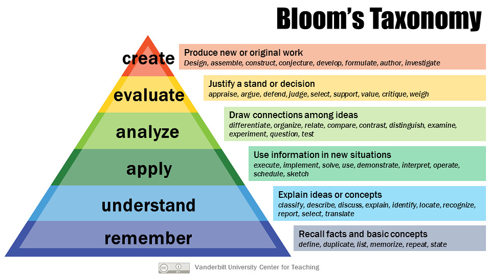
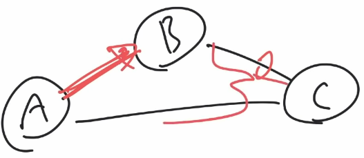
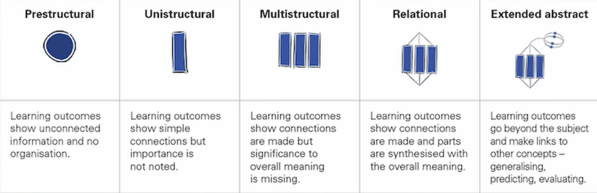
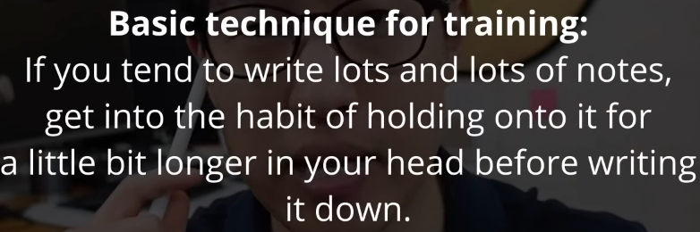
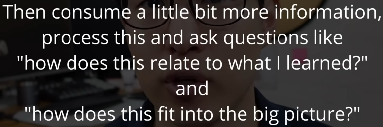
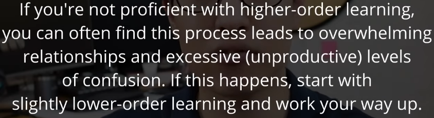

####################################################################
Encoding
####################################################################

(Summary from `this video <https://www.youtube.com/watch?v=VcT8puLpNKA>`_ by Justin Sung).

**DISCLAIMER: I do not own any of the images used in here. They are taken from the video that Justin doodled/used.**

================================================================================
Takeaways
================================================================================

#. Part 1: (`8:50 <https://www.youtube.com/watch?v=VcT8puLpNKA&t=530s>`_) Engage in higher order learning 

    .. image:: ../img/007encoding02.png
      :width: 300
      :alt: Encoding 02

#. Part 2: (`14:50 <https://www.youtube.com/watch?v=VcT8puLpNKA&t=890s>`_) Train cognitive load tolerance

    .. image:: ../img/007encoding03.png
      :width: 260
      :alt: Encoding 03
      
================================================================================
Details
================================================================================
  
Bloom's Taxonomy: https://tophat.com/blog/blooms-taxonomy/

Being able to remember is already considered to be the lowest level of learning.

But just understanding is not a very high level in the learning ladder either. Just being able to understand and being able to explain it to ourselves or others won't help us when we need to engage in tasks that requires skills such as applying, analyzing, evaluating or creativity.

Since working memory only serves us good for a few seconds or a few minutes, we should utilize this time to encode the information for our long term memory. It doesn't work to just read first and encode the ideas later. Engage in higher order learning AS EARLY AS POSSIBLE WHILE STUDYING.

For example, while watching a lecture video, don't just move on as you feel you understand the concept that are being explained. But focus on being able to use this information in new situation, draw connections among different ideas that you've read (see the note on mindmap techniques), 

================================================================================
Thinking in systems
================================================================================

* Understanding the inner working of the parts (individual components)
* Understanding the relations/connections/paths between different individual components

Second is more important than first.

================================================================================
Recipe
================================================================================

