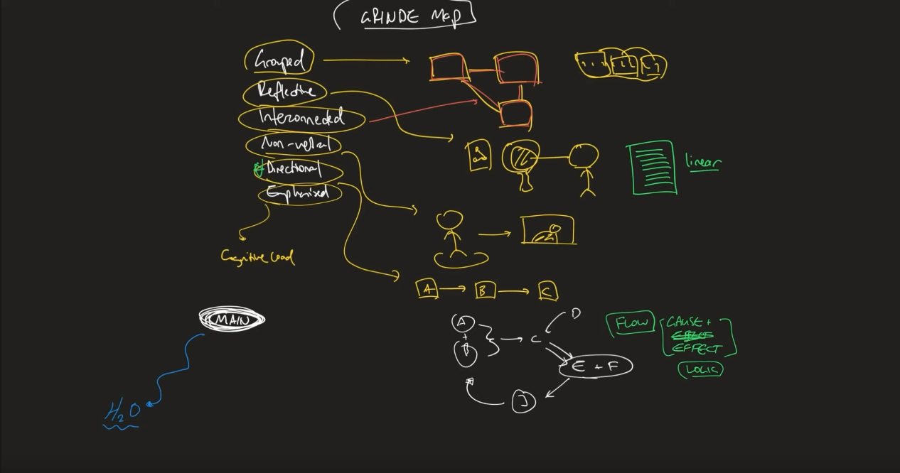

######################################################################
Mindmap techniques
######################################################################

(Summary from `this video <https://www.youtube.com/watch?v=5zT_2aBP6vM>`_ by Justin Sung).

**DISCLAIMER: I do not own any of the images used in here. They are taken from the video that Justin doodled.**

======================================================================
GRINDE map
======================================================================
#. Grouped - instead of learning concepts individually, chunk related concepts into groups
#. Reflective - The mind map should reflect the ideas exactly how it is represented inside your head. Linear note-taking techniques doesn't work because our thinking doesn't happen linearly, from left to right
#. Interconnected - try to find connections BETWEEN chunks to make an even bigger picture of the concept you're learning. This is different from chunking in the sense that the interconnectivity is not obvious while you're reading. The connections tend to appear often when we're working in relaxed mode (as opposed to focused mode) and trying to extract the most generic ideas or the overarching themes
#. Non-verbal - our brain doesn't think in words but it's really good to think in pictures. So make sure you doodle the concepts instead of just writing it in words
#. Directional - our brain remembers things when we see a clear sense of direction. This can include a cause and effect relationship, or a logical order in the development of the concepts.
#. Emphasized - make sure to highlight the KEY CONCEPTS in a different colour or font.
