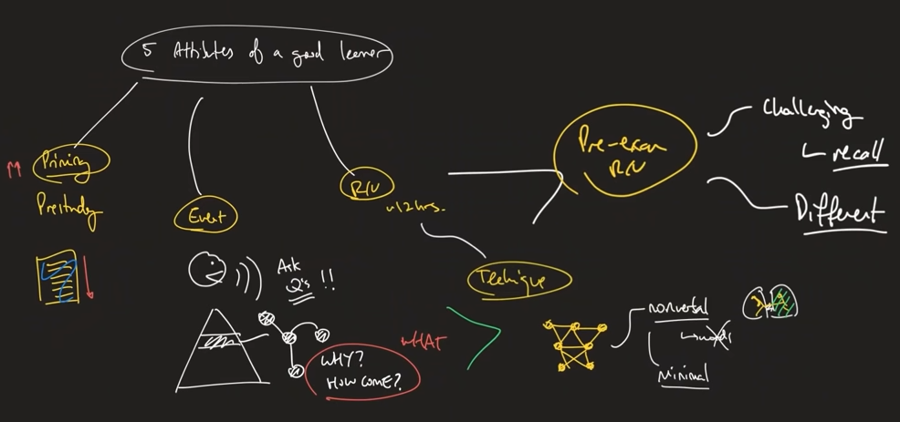

#################################################
5 Techniques of Every Successful Student
#################################################

(Summary from `this video <https://www.youtube.com/watch?v=RJKNtXgo39o>`_ by Justin Sung).

**DISCLAIMER: I do not own any of the images used in here. They are taken from the video that Justin doodled.**

============================================================
Takeaways
============================================================

#. Priming/prestudy - priming as I mentioned is a big topic and shouldn't be thought of simply as "prestudy". Whatever notion you have of prestudy to begin with should be abandoned. See if the way I explain it is the same as how you understand it.
#. Event engagement - in class or lecture. What are you doing to increase your effectiveness in the primary learning event? How much control do you exert here?
#. Post event review - when do you do it and...
#. Review technique - HOW do you consolidate the information in your post event review.
#. Pre-exam or test preparation - are you using this time effectively, or just creating an illusion of preparation?

============================================================
Details
============================================================

#. Priming (Almost like pre-studying but not the same)

    Skim through the content of your book/lecture notes to get a grasp on the bigger picture. So that connections become easier while learning the contents step-by-step.

#. Event (Something like a lecture happening where you acquire information)

    * Ask many questions as possible (To yourself or out loud) and also remember, ask more Why/How come questions than What questions.
    * Note down the topics you had trouble understanding and make them central while revising.
    * Delayed Note Taking : Take notes of a subject a few moments after the lecturer talks about it. So that it can create a sort of confusion in your head called Cognitive Load and makes studying much more effective. Make mindmaps!!!
    * (Extra Personal Tip : Try to navigate through the Bigger picture framework in your head while following through the lecture)

#. Revision and Consolidation

    * Revise the contents in 12 hours (after the event)
    * Make it challenging in a meaningful way. Aka Actively recall content (don't re-read your notes). Try to make mindmaps (with really few words) or TEACH.
